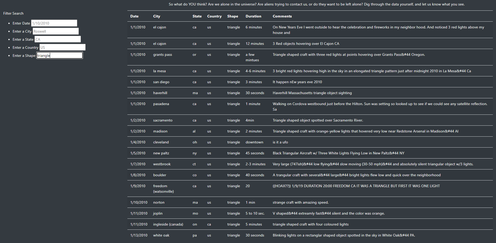
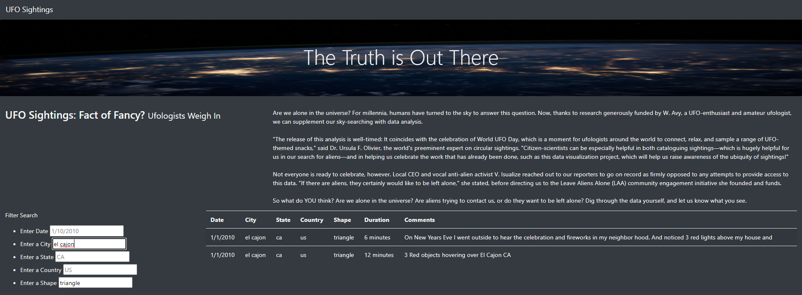

# UFOs
## Overview
The website that was created had good functionality, but Dana wanted a little more specfic information. Therefore we were tasked with adding filters to the existing website to further narrow the results. The filters that now exist are for the date, city, state, country, and shape.
## How to Use
The website is simple identify what you would like to narrow down on and search it. Let us say you want to search for a specfic shape of UFO. By going to the shape text field and putting in "Triangle" you will be given a list of entries all that have triangluar shaped sightings.

If you want to further narrow the results adding a city can help to make it very specfic.

## Summary
Overall I think that the website functions well and does what it needs. I think that the filters with the amount of data currently narrows the data too much and is a major drawback, limits what people can research by the total number of entries currently avaliable. I personally think adding a seperate page for personal reports for the users to fill out would be a interesting addition to the website, that would allow the entries to forever expand and always grow. I also think it is important to add verified reports in for research purposes, when writing a paper or investigating something it is not good to use unverified sources, therefore I think it would be a very good idea to add more official reports to the site to sort through. The filtering is already setup now just provide more data.
